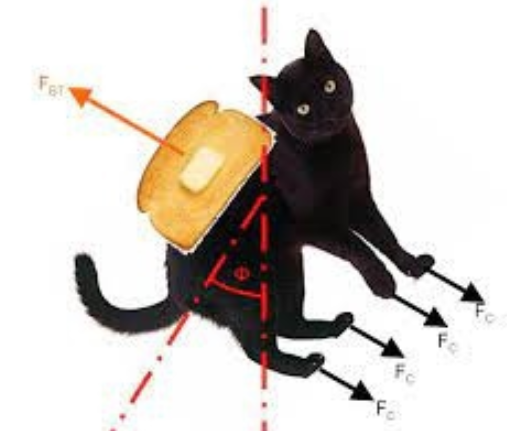
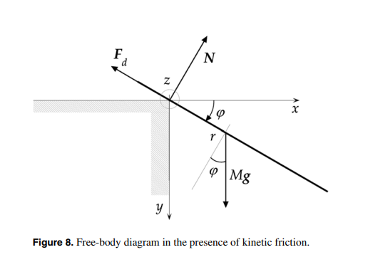
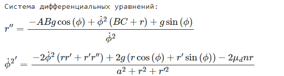
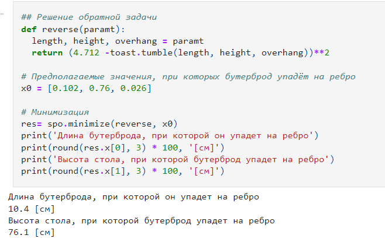
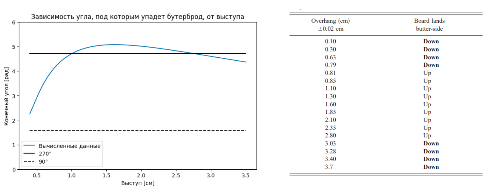

# Компьютерная модель падения бутерброда

  

С каждым время от времени происходят неприятные ситуации. Однако если неудачных дней становится слишком много, человек начинает верить в различные теории заговора или, например, общепринятые законы. В частности наиболее известным философским принципом является закон Мёрфи, который гласит:
> Если что-нибудь может пойти не так, оно пойдёт не так.

Физический объект, компьютерная модель которого была разработана в рамках данного проекта, – бутерброд с маслом, падающий со стола на пол. Согласно распространенному мнению бутерброд всегда будет падать маслом вниз. При помощи физических законов и средств вычислительной математики было установлено, является ли данное утверждение истинным и при каких условиях бутерброд упадет на ребро.

## Цель моделирования
Определить конкретные параметры, при которых бутерброд может упасть на ребро.

## Описание модели

  

**Стол**
- горизонтальная поверхность, находящаяся на некотором уровне над полом
- обладает статическим и кинетическим трением

**Бутерброд**
- прямоугольное тело (пренебрегаем шириной и толщиной)
- абсолютно твердое (пренебрегаем распределением плотности и деформацией)
- центр масс выступает за край стола
- совершает вращательное движение
- при столкновении с полом происходит неупругий удар (бутерброд неотскакивает)

## Моделирование
Симуляция движения бутерброда осуществлялась при помощи вычисления физических формул, описывающих динамику рассматриваемого объекта с входными параметрами. В процессе моделирования необходимо было решить задачу Коши. Решение  было найдено с помощью метода Рунге-Кутты, который используется при вызове функции solve_ivp(). Для решения уравнений использовался метод fsolve библиотеки scipy, предназначенной для выполнения научных и инженерных расчётов. В основе данного метода лежит модификация гибридного метода Пауэлла.

  

## Обратная задача

  

Для достижения цели нашей работы нам необходимо было решить обратную задачу, которая заключается в минимизации разницы искомого угла, под которым бутерброд упадет на ребро и значения целевой функции. Также для ускорения сходимости этой функции ее значение возводится в квадрат. Минимизация была осуществлена с помощью метода градиентного спуска.

## Оценка сходства
Для оценки качества модели было произведено сравнение полученных данных с экспериментальными данными из [статьи](https://citeseerx.ist.psu.edu/document?repid=rep1&type=pdf&doi=26a061e77c4a30dbf59db13f557b4598f497e066). В результате был получен график зависимости угла, под которым падает бутерброд, от выступа. Значения выступов для заданных углов совпали с данными из таблицы в статье, что подтвердило качество разработанной модели.

  

## Итоги
Для реализации проекта необходимо было освежить в памяти физические законы и математическую теорию, познакомиться с методами решения численных задач и научиться использовать Python библиотеки для инженерных вычислений и построения графиков. Было трудно, однако в ходе работы мы получили много положительных эмоций и смогли решить поставленную задачу.

## Авторы
Над проектом трудились студентки 3 курса ФИТ НГУ:
* Анна Воронова
* Алина Гусельникова

## Ссылки
* Bacon, M. E. ; Heald, George; James, Matt. A closer look at tumbling toast // American Journal of Physics, Volume 69, Issue 1, pp. 38-43 (2001) - https://citeseerx.ist.psu.edu/document?repid=rep1&type=pdf&doi=26a061e77c4a30dbf59db13f557b4598f497e066;
* Borghi, Riccardo. On the tumbling toast problem // European Journal of Physics, Volume 33, Issue 5, pp. 1407-1420 (2012) - https://gwern.net/doc/science/2012-borghi.pdf;
* Прочитать подробнее о нашем проекте можно здесь - https://docs.google.com/document/d/1CIVMSoTxS16ox8AYN52t24_nPTOgUWwVy8sc3cFI5E4/edit#heading=h.mlm64lgy0p5b.
